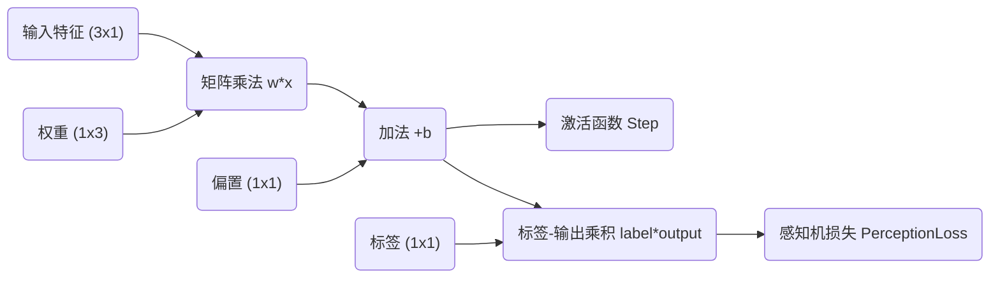

# torchlight

```mermaid
graph LR
    x("输入特征 (3x1)") --> matmul1("矩阵乘法 w*x")
    w("权重 (1x3)") --> matmul1
    matmul1 --> add("加法 +b")
    b("偏置 (1x1)") --> add
    add --> step("激活函数 Step")
    add --> matmul2("标签-输出乘积 label*output")
    label("标签 (1x1)") --> matmul2
    matmul2 --> loss("感知机损失 PerceptionLoss")
```