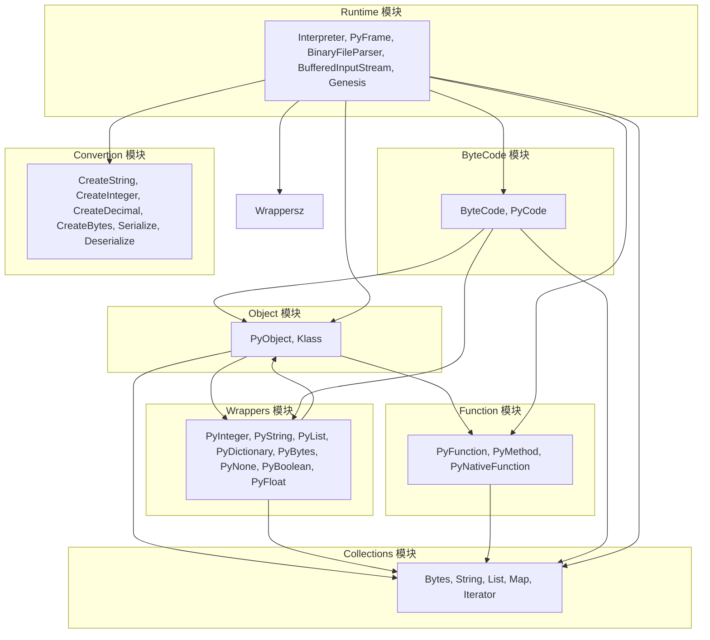

```mermaid
flowchart TD
  subgraph ObjectGroup[Object 模块]
    Object[PyObject, Klass]
  end

  %% 维护继承关系需要用到PyString, PyDictionary等包装类型
  Object --> Wrappers 
  %% 维护函数调用关系
  Object --> Function
  %% 依赖基本数据类型
  Object --> Collections

  subgraph WrappersGroup[Wrappers 模块]
    Wrappers[PyInteger, PyString, PyList, PyDictionary, PyBytes, PyNone, PyBoolean, PyFloat]
  end

  %% 继承关系
  Wrappers --> Object
  %% 依赖基本数据类型
  Wrappers --> Collections

  subgraph FunctionGroup[Function 模块]
    Function[PyFunction, PyMethod, PyNativeFunction]
  end

  %% 依赖基本数据类型
  Function --> Collections
  
  subgraph ByteCodeGroup[ByteCode 模块]
    ByteCode[ByteCode, PyCode]
  end

  %% 依赖基本数据类型
  ByteCode --> Collections
  %% 依赖包装类型
  ByteCode --> Wrappers
  %% 继承关系
  ByteCode --> Object

  subgraph RuntimeGroup[Runtime 模块]
    Runtime[Interpreter, PyFrame, BinaryFileParser, BufferedInputStream, Genesis]
  end

  %% 依赖基本数据类型
  Runtime --> Collections
  %% 依赖包装类型
  Runtime --> Wrappersz
  %% 依赖函数
  Runtime --> Function
  %% 依赖字节码
  Runtime --> ByteCode
  %% 依赖对象
  Runtime --> Object
  %% 依赖转换
  Runtime --> Convertion

  subgraph CollectionsGroup[Collections 模块]
    Collections[Bytes, String, List, Map, Iterator]
  end

  %% Collections 没有依赖

  subgraph ConvertionGroup[Convertion 模块]
    Convertion[CreateString, CreateInteger, CreateDecimal, CreateBytes, Serialize, Deserialize]
  end


```